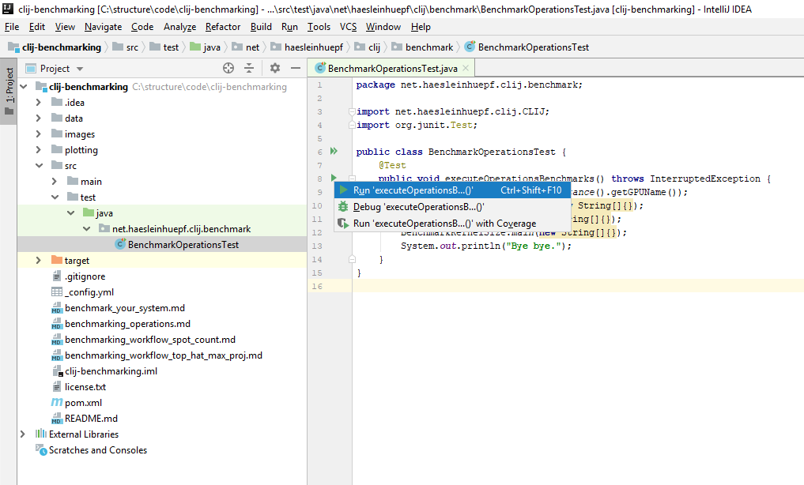

# Contributing to CLIJ by benchmarking your system

You can contribute to this project by benchmarking your system and submitting the resulting time measurement files as pull-request via github.

## Installation instructions
If you want to execute the benchmarks in this repository, we recommend installing
* [Maven](http://maven.apache.org/install.html)
* [Git](https://git-scm.com/)
* [wget](https://www.gnu.org/software/wget/)
* [Oracle JDK 8](https://www.oracle.com/technetwork/java/javase/downloads/jdk8-downloads-2133151.html)
* [IntelliJ](https://www.jetbrains.com/idea/)
* [Fiji](http://fiji.sc/)
* [CLIJ](https://clij.github.io/clij-docs/installationInFiji)

Furthermore, we recommend a minimum of 1 GB of GPU memory for the operations benchmarking and 4 GB of GPU memory for the workflow benchmarking.

## Benchmarking operations

In order to run operations benchmarking, you should clone this repository

```
git clone https://github.com/clij/clij-benchmarking
```

You can then use maven to execute the operations benchmarks

```
cd clij-benchmarking
mvn test
```

Alternatively, you can run the benchmarks from IntelliJ. Open pom.xml in the root of the repository as project with IntelliJ.


## Benchmarking workflows
In order to benchmark the workflows, you need to download the used image data first. You can use wget for that:

```
mkdir clij-data
cd clij-data
for ((i=117;i<=416;i++)); do wget https://bds.mpi-cbg.de/CLIJ_benchmarking_data/000${i}.raw.tif; done
```

Afterwards, run Fiji and open the ImageJ macros [in this folder](https://github.com/clij/clij-benchmarking/tree/master/src/main/macro_benchmarking_workflow).
Adapt the folders mentioned in the header of the macros and change the computer name before running them.
Please make sure that no other program is running heavy operations on the computer at the same time. 
Close browsers, email programs and install updates in advance. 
Restart Fiji before executing the benchmarking.

## Submitting benchmark results as pull request
Please consider submitting a pull-request with your benchmarking results - especially the operations benchmarks as they may be of broad interest. 
This would allow us to build up a database of GPUs and their performance when using CLIJ.

[Back to CLIJ documentation](https://clij.github.io/)

[Imprint](https://clij.github.io/imprint)

