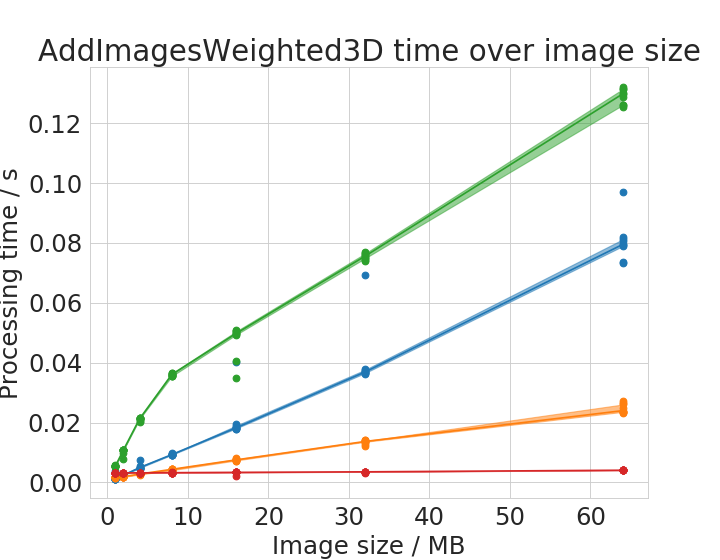
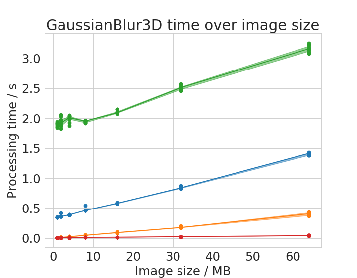
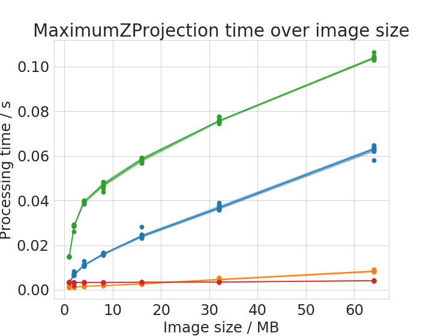
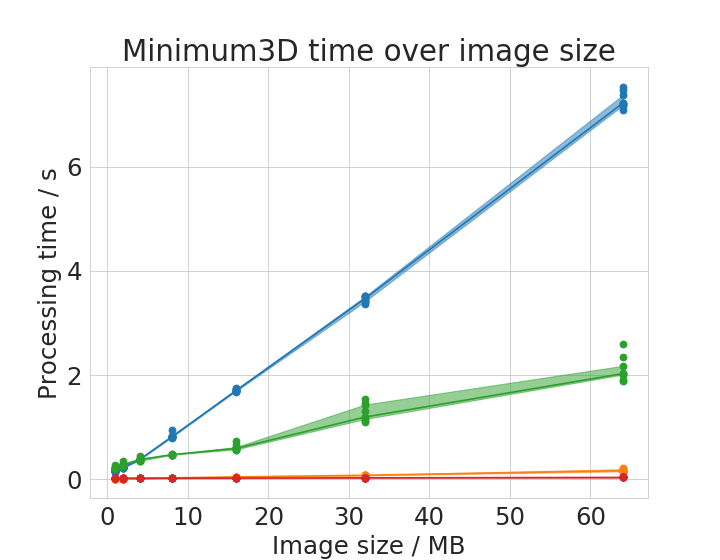
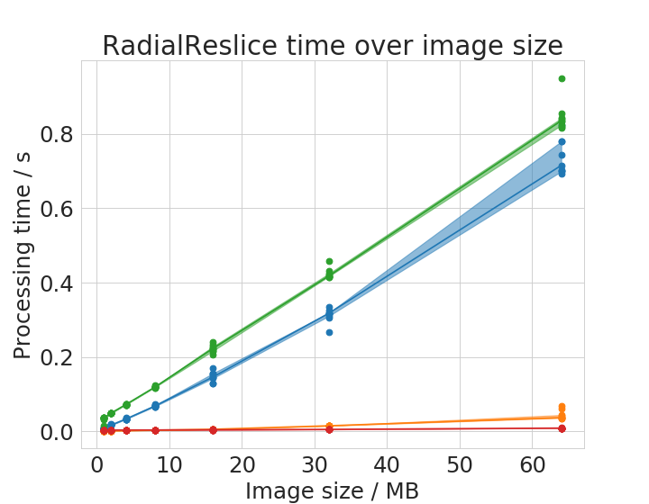
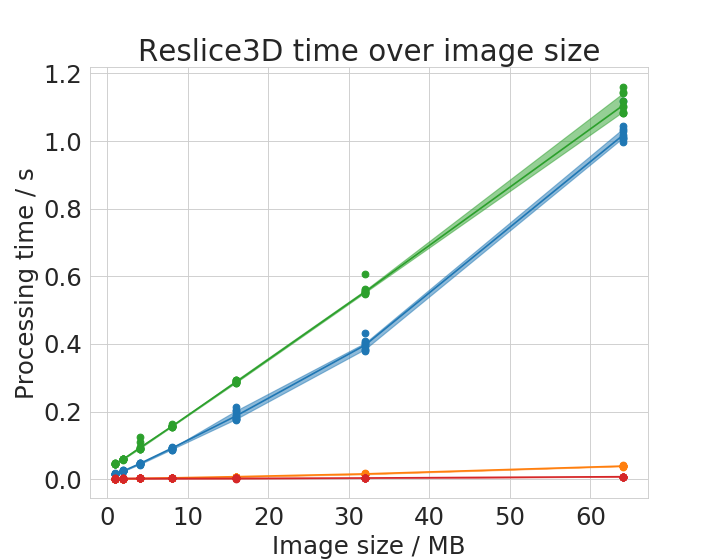
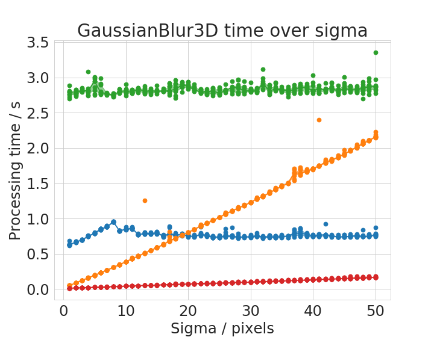
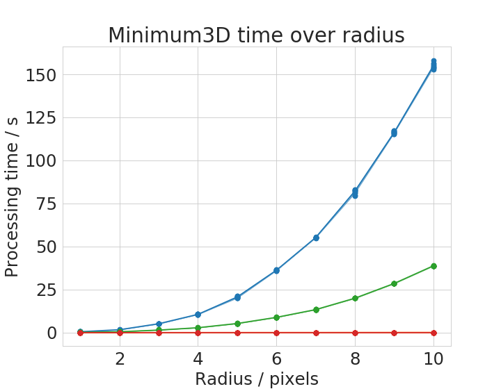
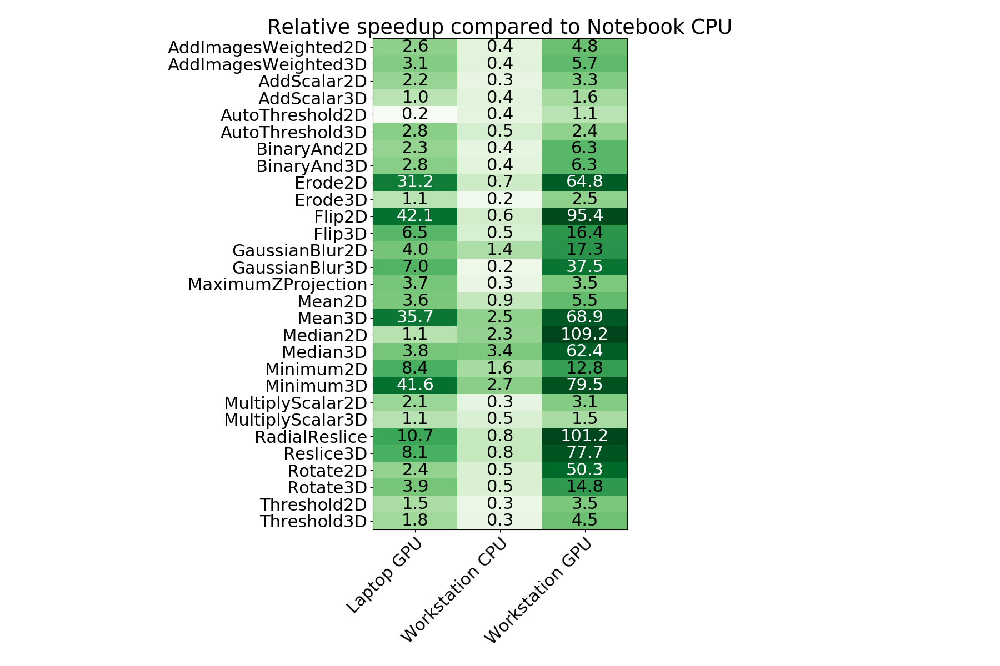

# Benchmarking CLIJ operations versus ImageJ/Fiji operations

---

__Note: This page is outdated. We changed the benchmarking to use JMH. See [here](https://clij.github.io/clij-benchmarking/benchmarking_operations_jmh) for the new benchmarking report. This page is just kept for allowing reproducing our results from the first BioRxiv preprint version of the paper.__

---

In order to measure performance differences between ImageJ and CLIJ operations, we conducted benchmarking experiments.

## Benchmarking operations
First, we set up a list of operations to benchmark in more detail. The list contains typical operations such as
morpholigical filters, binary image operations, thresholding and projections. The operations were encapsulated in
respective Benchmarking modules and put in a [Java package](https://github.com/clij/clij-benchmarking/tree/master/src/main/java/net/haesleinhuepf/clij/benchmark/modules);
Each of these modules has two test methods: One that processes images in the ImageJ-way and another that executes an 
as-similar-as-possible operation using CLIJ. Both methods measure the pure processing time excluding time spent for
data transfer between CPU and GPU for example. An exceptional module called [Transfer3DFrom](https://github.com/clij/clij-benchmarking/blob/master/src/main/java/net/haesleinhuepf/clij/benchmark/modules/Transfer3DFrom.java)
is used to quantify the transfer time exclusively. 
In order to measure pure processing times of the operations, image data transfor from/to GPU was excluded. 
Furthermore, GPU-code compilation time was excluded by ignoring the first out of 10 repetitions.
During this so called warm-up phase, compiled GPU-code is cached and can be reused in subsequent iterations.

## Image data
For benchmarking operations, we used images with random pixel values of pixel type 8-bit with a size of 16 MB if not specified otherwise. 
The 2D-operations were tested on images of size 4096 x 4096. The 3D-operations received 256 x 256 x 256 large image stacks for processing.

## Benchmarked computing hardware
Benchmarking was executed on 
* a laptop with an Intel Core i7-8650U CPU and a Intel UHD 620 GPU ("MYERS-PC-21"), 
* a workstation with an Intel Xeon Silver 4110 CPU in combination with a Nvidia Quadro P6000 GPU ("MYERS-PC-22"). 

## Results

### Transfer time
The measured median transfer times +- standard deviations show clear differences between notebook 
(push: 0.5 +- 0.4 GB/s, pull 0.4 +- 0.5 GB/s) and workstation (push: 1.3 +- 0.6 GB/s, pull: 1.3 +- 0.4 GB/s ) 
suggesting that the data transfer is faster on the workstation.
These numbers can be retraced by executing the [analyse_transfer_time.py](https://github.com/clij/clij-benchmarking/tree/master/plotting/python/analyse_transfer_time.py)

These plots were done with the [plotCompareMachinesTransferImageSize.py](https://github.com/clij/clij-benchmarking/tree/master/plotting/python/plotCompareMachinesTransferImageSize.py) script.

### Processing time depends on image size
We chose six operations to plot processing time with respect to image size in detail. 

Time benchmark measurement raw data are [available online](https://github.com/clij/clij-benchmarking/tree/master/data/benchmarking/imagesize/);
These plots were done with the [plotCompareMachinesImageSize.py](https://github.com/clij/clij-benchmarking/tree/master/plotting/python/plotCompareMachinesImageSize.py) script.

Some of the operations show different behaviour with small images compared to large images. 
There is apparently not a linear or polynomial relationship between image size and execution time. 
We assume that the cache of the CPU allows ImageJ operations running on the CPU to finish faster with small images compared to large images.
This is reasonable as these caches usually hold several megabytes.

### Processing time depends operation specific parameters
Some operations have parameters influencing processing time. 
We chose two representative examples: the Gaussian Blur filter whose processing time might depend on its sigma parameter 
and the Minimum filter whose processing time might depend on the entered radius parameter.

Time benchmark measurement raw data are [available online](https://github.com/clij/clij-benchmarking/tree/master/data/benchmarking/kernelsize/);
These plots were done with the [plotCompareMachinesKernelSize.py](https://github.com/clij/clij-benchmarking/tree/master/plotting/python/plotCompareMachinesKernelSize.py) script.

The Gaussian Blur filter in ImageJ is optimized for speed. Apparently, it is an implementation which is independent from kernel size. 
Thus, with very large kernels, it can perform faster than it GPU-based counter part. 
The Minimum filter shows an apparently polynomial increasing time with increasing filter radius. 

### Speedup of operations
We also generated an overview of speedup factors for all tested operations. 
The speedup was calculated relative to the ImageJ operation executed on the laptop CPU.

Time benchmark measurement raw data are [available online](https://github.com/clij/clij-benchmarking/tree/master/data/benchmarking/all/);
This plot was generated with the [plotCompareMachinesAllOperations.py](https://github.com/clij/clij-benchmarking/tree/master/plotting/python/plotCompareMachinesAllOperations.py) script.

This table shows some operations to perform slower (speedup < 1) on the workstation CPU in comparison to the notebook CPU. 
We see the reason in the single thread performance resulting from the clock rate of the CPU.
While the [Intel i7-8650U](https://ark.intel.com/content/www/us/en/ark/products/124968/intel-core-i7-8650u-processor-8m-cache-up-to-4-20-ghz.html) 
is a high end mobile CPU with up to 4.2 GHz clock rate, the 
[Intel Xeon Silver 4110](https://ark.intel.com/content/www/us/en/ark/products/123547/intel-xeon-silver-4110-processor-11m-cache-2-10-ghz.html)
has a maximum clock rate of 3 GHz. On the other hand, there are operations shown which run faster on the workstation CPU. 
We assume that the algorithms implemented exploit multi-threading for higher performance yield. The workstation CPU has 8 physical cores while the laptops CPU has just 4.

### Contributing to this project
If you want to contribute to this project, feel free to clone the repository, [execute the benchmarks](http://clij.github.io/clij-benchmarking/benchmark_your_system) and file a pull request with your measurements! Also, please specify your CPU and GPU hardware when filing the PR.

[Back to CLIJ documentation](https://clij.github.io/)

[Imprint](https://clij.github.io/imprint)

