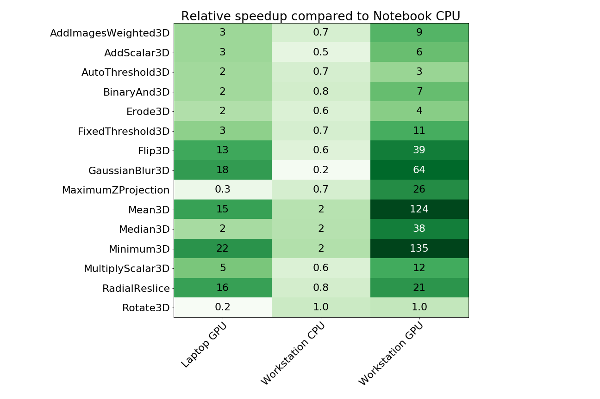
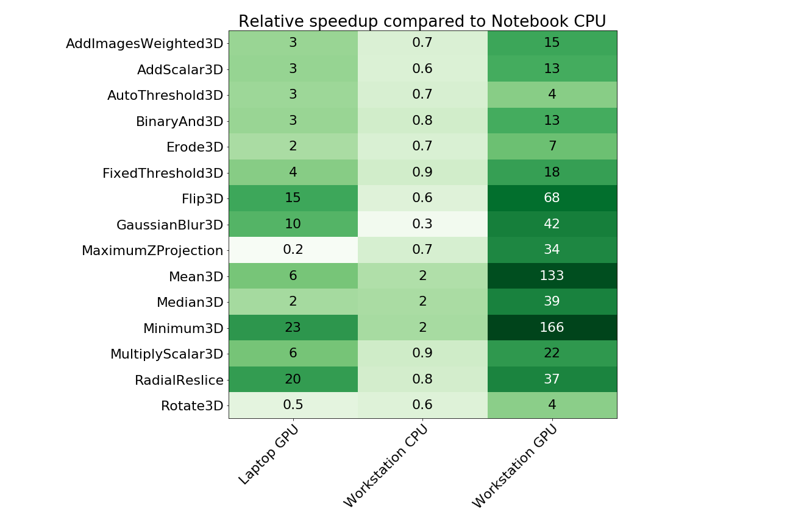
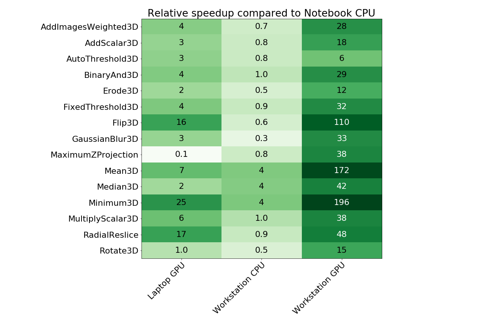
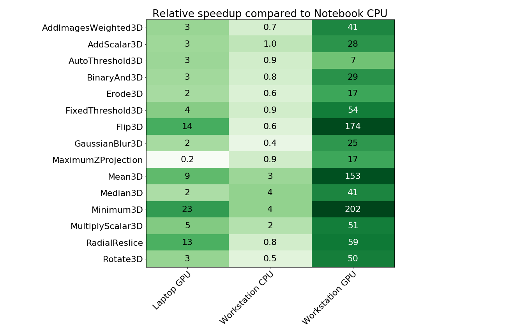

# Speedup factors for 3D images

## 1x1x1 (2B) Byte images

## 1024x1024x8 (16 MB) images

## 1024x1024x16 (32 MB) Byte images

## 1024x1024x32 (64 MB) Byte images

## 1024x1024x64 (128 MB) Byte images

[Back to CLIJ documentation](https://clij.github.io/)

[Imprint](https://clij.github.io/imprint)
