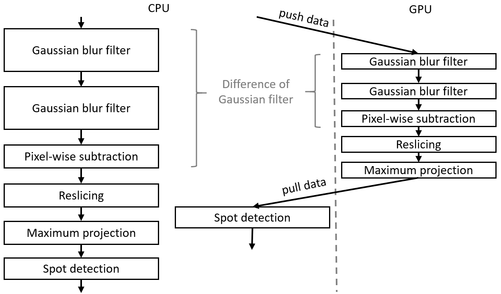
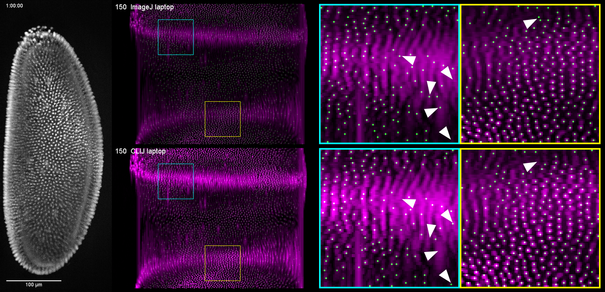
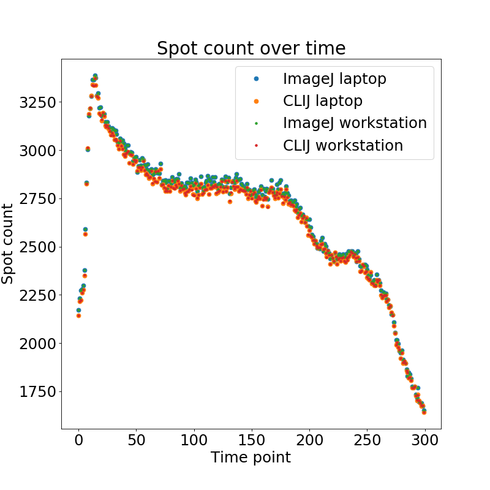

# Benchmarking a CLIJ workflow versus ImageJ/Fiji 
In order to measure performance differences between ImageJ and CLIJ based workflows, we conducted benchmarking experiments.

## Benchmarking workflows
To demonstrate a whole workflow and its potential speedup using CLIJ, we chose an image-processing workflow 
used to estimate the cell count in three dimensional Drosophila melanogaster embryo data sets acquired with light sheet microscopy. 

##  Image data
The workflows were benchmard using image stacks acquired on a custom multi-view light-sheet microscope with two detection arms giving opposing views on the sample.
The imaged Drosophila line ([flybase 23651](http://flybase.org/reports/FBst0023651) shows histone-RFP marked nuclei when
being imaged using a 594 nm laser. 
The used image data is [available online](https://bds.mpi-cbg.de/CLIJ_benchmarking_data/).
The image stacks stored with 16 bits per voxel are 121 MB large on disc, with 512x1024x121 voxels and a voxel size of
0.52 x 0.52 x 2.0 cubic micrometer.  
For the benchmarking, 300 image stacks acquired while the embryo develops from stage 4 to stage 8 were analysed.

## Benchmarked computing hardware
Benchmarking was executed on 
* a laptop with an Intel Core i7-8650U CPU and a Intel UHD 620 GPU ("MYERS-PC-21"), 
* a workstation with an Intel Xeon Silver 4110 CPU in combination with a Nvidia Quadro P6000 GPU ("MYERS-PC-22"). 

## Image analysis workflow

The presented workflow consists of these major steps:
* Before the image data is pushed to the GPU, we cropped the image stack to 400x1024x121 voxels to have the embryo of this particular data set in the center.
Furthermore, we converted the image stack to 32-bit float as the following procedure needs float precision. 
Thus, the processed image stacks are 189 MB large.
* The image stacks are then used to generate a Difference-of-Gaussian (DoG) image. 
* The DoG image stack is resampled to get voxels with isotropic dimensions.
* A cylindrical reslicing transformation and a maximum projection are used to project the nuclei on the Drosophilas surface onto a two-dimensional image. 
* In this image ImageJ "Find Maxima" menu, a spot-detection algorithm, is applied to estimate the number of nuclei. 

The source code of both workflows is [available online](https://github.com/clij/clij-benchmarking/blob/master/src/main/macro_benchmarking_workflow/).

When benchmarking the two workflows, we also included data transfer time, file read/write times and compilation time to give a realistic 
impression of how much workflows can be sped up by GPU-acceleration. 
Furthermore, to minimize harddrive I/O speed influencing the benchmark, both workflows loaded the image data from a USB 3.1 flash disc and also saved the resulting image data on it.

Time benchmark measurement raw data for both workflows are [available online](https://github.com/clij/clij-benchmarking/tree/master/data/benchmarking/cellcount/);
The resulting projection images are [available online](https://git.mpi-cbg.de/rhaase/clij-benchmarking-data/tree/master/data/benchmark/) as well.

## Benchmarking workflows

The ImageJ-based workflow running on the laptop CPU needed 2 hours and 44 minutes to process the full time lapse.
CLIJ running on the laptop GPU took 11 minutes.
When exeuting the ImageJ workflow on the workstation, it finished after 41 minutes.
CLIJ running on the workstation GPU finished after 5 minutes.
Thus, the speedup when switching from the laptops CPU to the GPU-accelerated workflow was 15. 
Switching from the laptop GPU to the workstation GPU speeds up by a factor of 33.

Furthermore, excluding file I/O and compilation times, the pure average processing time for one image stacke can be compared. 
It was 31.8 seconds for ImageJ on the laptop, 1.2 seconds using CLIJ on the laptop, 6.1 seconds using ImageJ on the workstation and 0.4 seconds using CLIJ on the workstation.
  
The measurements in this section can be reproduced using the [AnalyseWorkflowBTimes.ipynb](https://github.com/clij/clij-benchmarking/tree/master/plotting/python/AnalyseWorkflowBTimes.ipynb) Jupyter notebook. 

## Visual comparison 
Visual comparison of the results of the workflows reveals no obvious differences between the surface projection images. 
However, the spot detection show differences in regions of the 2D projection where nuclei are hard to differentiate also for the human observer. 
These regions, below marked with white triangles are located in center of the embro. 
Center in this context means in the middle between the two detection objectives utilized in the multi-view light sheet microscope which acquired the image data.

LINK TO VIDEO COMING SOON
The macros generating the video are [available online](https://github.com/clij/clij-benchmarking/blob/master/src/main/macro_visualising_workflow_results/).

## Quantitative comparsion of workflow results
By plotting the spot count of the two workflows executed on the two test systems over time we get a first impression on the estimation of the cell count:

During the first time points, the time lapse shows a mitotic wave which explains the peak in spot count.
Afterwards, when nuclei increase visually in size, the spot count goes down until appoximately time point 80. 
Then, between time point 80 and 180, spot count stays mostly constant. This is stage 5 of Drosophila embryo development.
Afterwards, as soon as gastrulation starts, the spot count decreases again which is related to the invagination of cells.
As the workflow count spots on a surface projection, it cannot detect nuclei in multiple layers. 

Quantifying the overall measurements revealed that mean relative differences of 0.9 +- 0.6% when comparing the workflows based on ImageJ and CLIJ. 

As results on Workstation and Laptop were not identical when using CLIJ, we also compared the results in more detail: 
We observed a mean relative difference 0.05 +- 0.04 % between the identical code being run on an Intel HD versus Nvidia card. 

Comparison of spot count results reveals that there were no differences between ImageJ on Workstation and Laptop detected.

Numbers and plots listed in this section can be reproduced using the [Analyse_differences](https://github.com/clij/clij-benchmarking/tree/master/plotting/python/Analyse_differences.ipynb) Jupyter notebook. 

### Contributing to this project
If you want to contribute to this project, feel free to clone the repository, [execute the benchmarks](http://clij.github.io/clij-benchmarking/benchmark_your_system) and file a pull request with your measurements! Also, please specify your CPU and GPU hardware when filing the PR.

[Back to CLIJ documentation](https://clij.github.io/)

[Imprint](https://clij.github.io/imprint)
